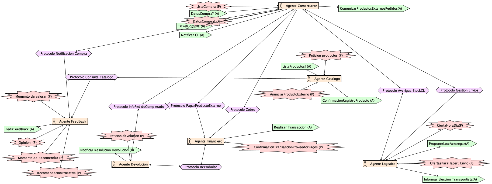
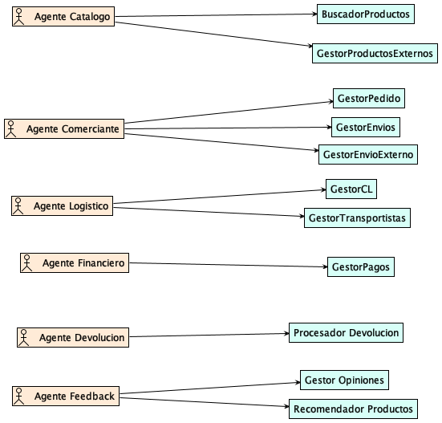
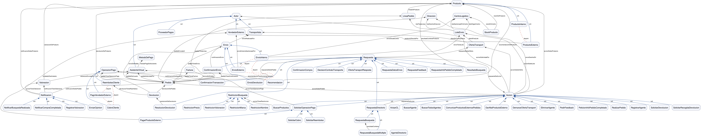

# Práctica ECSDI - Memoria final

## Capítulo 1. Introducción

Esta memoria describe el diseño y la implementación de un sistema multiagente
para una tienda de comercio electrónico. El sistema permite buscar productos,
comprar productos internos y externos, coordinar envíos, negociar con
transportistas, cobrar y reembolsar operaciones, pagar a vendedores externos,
tramitar devoluciones, solicitar valoraciones y generar recomendaciones.

El trabajo se ha desarrollado siguiendo la metodología Prometheus. La
especificación, el diseño arquitectónico y el diseño detallado se mantienen en
`pdtool/especificacion-diseno.pd` y en los informes exportados desde PDT. La
ontología compartida se encuentra en `ontology/comercio_electronico.ttl`, y la
implementación ejecutable está en `src/`.

La solución usa agentes especializados que se comunican mediante mensajes RDF
con una envoltura FIPA-ACL. La ontología define el vocabulario común para las
acciones, respuestas, notificaciones y entidades de negocio. El servicio de
directorio permite registrar y descubrir agentes por tipo funcional y por
capacidad, lo que facilita la ejecución distribuida.

### 1.1. Objetivos funcionales

Los objetivos funcionales cubiertos por la solución son:

| Objetivo | Cobertura |
| --- | --- |
| Buscar productos | Búsqueda RDF/SPARQL en catálogo con restricciones de nombre, marca, precio y valoración. |
| Comprar productos | Pedido con factura, cobro, envío y persistencia del pedido completado. |
| Gestionar productos externos | Alta de productos externos y aviso al vendedor cuando se compran. |
| Coordinar logística | Centros logísticos con stock, lotes de envío y negociación con transportistas. |
| Gestionar pagos | Cobro al usuario, reembolso y pago a vendedores externos. |
| Gestionar devoluciones | Validación de pedido completado, recogida y reembolso. |
| Solicitar feedback | Petición diferida de valoración al asistente virtual. |
| Recomendar productos | Acción `RecomendacionProactiva` en el PD, con recomendaciones RDF enviadas al asistente. |
| Ejecutar distribuido | Agentes con `/comm`, registro FIPA en directorio y scripts de despliegue. |

### 1.2. Elementos avanzados implementados

Además del flujo básico, la implementación cubre varios elementos avanzados:

| Elemento | Implementación |
| --- | --- |
| Transportistas dinámicos | Varios `TransportistaAgent` registrados en el directorio; los centros logísticos solicitan ofertas y aceptan la mejor. |
| Multi-centro logístico | Varios `CentroLogisticoAgent`, cada uno con stock y ciudad; cada centro filtra las líneas que puede servir. |
| Agentes de pago | `AgenteFinanciero` y `ProveedorPagosAgent` separan la lógica financiera de la pasarela simulada. |
| Feedback y recomendación | `AgenteFeedback` registra compras, pide opiniones y ejecuta recomendaciones periódicas. |
| Directorio FIPA | `DirectoryService` recibe `RegistrarAgente`, `BuscarAgente`, `BuscarTodosAgentes` y `EliminarAgente` mediante FIPA-ACL. |

### 1.3. Artefactos entregables

| Artefacto | Ruta |
| --- | --- |
| Modelo Prometheus | `pdtool/especificacion-diseno.pd` |
| Informe Prometheus | `pdtool/defaultreport_2026-05-26/` |
| Ontología OWL/Turtle | `ontology/comercio_electronico.ttl` |
| Documentación PyLODE | `ontology/comercio_electronico.html` |
| Diagrama de ontología | `ontology/comercio_electronico.png` y `ontology/comercio_electronico.svg` |
| Código fuente | `src/` |
| Escenarios de prueba | `doc/test-scenarios.md` |
| Guía de demo distribuida | `doc/distributed-demo.md` |

## Capítulo 2. Especificación del sistema

La especificación del sistema identifica los objetivos, escenarios, roles y
percepciones/acciones relevantes del dominio. El modelo fuente está en
`pdtool/especificacion-diseno.pd`.

### 2.1. Analysis Overview

El sistema representa una tienda electrónica que actúa como intermediaria entre
clientes, catálogo, centros logísticos, transportistas, vendedores externos y
servicios financieros. El problema requiere coordinación distribuida porque
cada parte posee responsabilidades y conocimiento parcial:

- El catálogo conoce productos y restricciones de búsqueda.
- El comerciante coordina el flujo de compra.
- Los centros logísticos conocen stock y capacidad de preparación.
- Los transportistas proponen condiciones de entrega.
- El financiero gestiona operaciones económicas.
- Feedback conoce compras, búsquedas, valoraciones y recomendaciones.
- Devolución decide si una devolución puede aceptarse.

El uso de agentes permite asignar autonomía a cada componente y separar la
lógica de negocio de la comunicación. El uso de RDF/FIPA-ACL permite que los
agentes compartan significado sin depender de estructuras internas de Python.

### 2.2. Goal Overview

Los objetivos principales del sistema son:

| Objetivo | Descripción |
| --- | --- |
| Buscar productos | Encontrar productos que satisfacen restricciones del usuario. |
| Crear pedido | Construir un pedido desde la selección del asistente. |
| Finalizar compra | Generar factura, envío, cobro y registro del pedido completado. |
| Preparar envío | Seleccionar centros con stock y organizar lotes. |
| Negociar transporte | Pedir ofertas, comparar precios/plazos y elegir transportista. |
| Gestionar producto externo | Registrar productos de vendedores externos y avisar compras. |
| Realizar cobro | Cobrar al usuario por el pedido. |
| Pagar vendedor externo | Pagar al vendedor cuando su producto se vende. |
| Validar devolución | Comprobar que el producto pertenece a un pedido completado. |
| Reembolsar devolución | Solicitar reembolso si la devolución es aceptada. |
| Pedir feedback | Solicitar valoración tras la entrega. |
| Recomendar productos | Ejecutar `RecomendacionProactiva` y enviar recomendaciones al asistente. |

### 2.3. Scenarios

Los escenarios principales usados en el análisis son:

| Escenario | Flujo resumido |
| --- | --- |
| Búsqueda de producto | Asistente -> Catálogo: `BuscarProductos`; Catálogo -> Asistente: `ResultadoBusqueda`; Catálogo -> Feedback: `NotificarBusquedaRealizada`. |
| Compra de producto interno | Asistente -> Comerciante: `RealizarPedido`; Comerciante coordina logística, factura, cobro y feedback. |
| Compra con producto externo | Vendedor externo registra producto; Comerciante avisa compra y Financiero ejecuta `PagarProductoExterno`. |
| Envío multi-CL | Comerciante envía `AvisarCL` a centros logísticos; cada centro sirve las líneas para las que tiene stock. |
| Negociación transporte | Centro logístico solicita presupuesto a transportistas, compara `OfertaTransporte` y envía decisión. |
| Feedback diferido | Feedback registra compra completada y programa `PedirFeedback`. |
| Recomendación proactiva | Feedback ejecuta `RecomendacionProactiva`; el asistente recibe instancias `Recomendacion`. |
| Devolución | Asistente solicita `SolicitarDevolucion`; Devolución valida, organiza recogida y pide reembolso. |

### 2.4. System Roles

Los roles del sistema se agrupan así:

| Rol | Responsabilidad |
| --- | --- |
| BuscadorProductos | Consultar el catálogo y devolver productos candidatos. |
| GestorProductosExternos | Registrar productos externos y asociarlos a vendedores. |
| GestorPedido | Crear y finalizar pedidos. |
| GestorEnvios | Coordinar la preparación y confirmación de envíos. |
| GestorCL | Gestionar stock y líneas servibles por centro logístico. |
| GestorTransportistas | Solicitar y comparar ofertas de transporte. |
| GestorPagos | Gestionar cobros, pagos externos y reembolsos. |
| Gestor Opiniones | Pedir y almacenar valoraciones. |
| Recomendador Productos | Generar recomendaciones a partir del histórico. |
| Procesador Devolucion | Validar y resolver devoluciones. |
| Directorio/Matchmaker | Registrar agentes y resolver búsquedas por tipo/capacidad. |

### 2.5. Trazabilidad con la implementación

| Requisito de análisis | Agentes/código que lo cubren |
| --- | --- |
| Búsqueda de productos | `agente_catalogo.py`, `utilities/catalog.py`, `build_search_message`. |
| Pedido y compra | `agente_comerciante.py`, `build_order_message`. |
| Envío y transporte | `centro_logistico_agent.py`, `transportista_agent.py`. |
| Cobro/reembolso/pago externo | `agente_financiero.py`, `proveedor_pagos_agent.py`. |
| Alta de productos externos | `agente_VendedorExterno.py`, `agente_catalogo.py`. |
| Feedback y recomendaciones | `agente_feedback.py`, `agente_asistente.py`. |
| Devoluciones | `agente_devolucion.py`. |
| Directorio | `directory_service.py`, `utilities/runtime.py`. |

## Capítulo 3. Diseño arquitectónico

El diseño arquitectónico define la organización de agentes, datos compartidos y
protocolos. Los diagramas principales están exportados en
`pdtool/defaultreport_2026-05-26/`.



### 3.1. Data Coupling

Los agentes no comparten objetos Python directamente. Intercambian grafos RDF
con términos de la ontología y persisten datos de ejecución en ficheros RDF,
TriG o JSON auxiliar.

| Fuente | Ruta | Formato | Responsable |
| --- | --- | --- | --- |
| Ontología | `ontology/comercio_electronico.ttl` | Turtle/OWL | Equipo |
| Catálogo | `src/data/catalog.ttl` + grafo `catalog` | Turtle/TriG | Agente Catálogo |
| Pedidos completados | `src/data/completed_orders/*.ttl` | Turtle/TriG | Agente Comerciante |
| Búsquedas | `src/data/searches.json` + grafo `searches` | JSON + RDF | Agente Feedback |
| Opiniones | `src/data/opinions.json` + grafo `opinions` | JSON + RDF | Agente Feedback |
| Devoluciones | `src/data/devoluciones.json` + grafo `returns` | JSON + RDF | Agente Devolución |
| Directorio | `src/data/directory.ttl` | Turtle | DirectoryService |
| Dataset común | `src/data/dataset.trig` | TriG | Utilidades de persistencia |

El uso de JSON es auxiliar y facilita la inspección durante la demo. El estado
relevante también se materializa como RDF para mantener una representación
semántica del sistema.

### 3.2. Agent-Role Grouping



| Agente | Roles agrupados | Justificación |
| --- | --- | --- |
| Agente Catalogo | BuscadorProductos, GestorProductosExternos | La búsqueda y el alta modifican el mismo catálogo. |
| Agente Comerciante | GestorPedido, GestorEnvios | El pedido es el punto de coordinación de la compra. |
| CentroLogisticoAgent | GestorCL, GestorTransportistas | Cada centro conoce su stock y negocia transporte. |
| Agente Financiero | GestorPagos | Agrupa cobros, reembolsos y pagos externos. |
| Agente Feedback | Gestor Opiniones, Recomendador Productos | Las recomendaciones dependen de búsquedas, compras y opiniones. |
| Agente Devolucion | Procesador Devolucion | Separa la lógica de devolución del flujo de compra. |
| DirectoryService | Directorio/Matchmaker | Servicio transversal de infraestructura. |

Además, la implementación convierte algunos actores externos del PD en agentes
ejecutables (`TransportistaAgent`, `ProveedorPagosAgent`,
`AgenteVendedorExterno` y `AgenteAsistente`) para poder demostrar la
comunicación real entre procesos.

### 3.3. Agent Acquaintance

| Agente | Conoce o descubre | Motivo |
| --- | --- | --- |
| Asistente | Catálogo, Comerciante, Feedback | Buscar, comprar, valorar y recibir recomendaciones. |
| Catálogo | Feedback | Notificar búsquedas realizadas. |
| Comerciante | Centros logísticos, Financiero, Feedback, Vendedor externo | Coordinar la compra completa. |
| Centro logístico | Transportistas | Solicitar presupuestos para lotes. |
| Financiero | Proveedor de pagos | Ejecutar operación económica. |
| Devolución | Comerciante, Transportista, Financiero | Validar, recoger y reembolsar. |
| Todos | DirectoryService | Registro y descubrimiento. |

Cuando los agentes se arrancan con `--dir`, las direcciones se obtienen del
directorio. Las URL hardcodeadas solo se usan como fallback en demos locales.

### 3.4. Protocols

Los protocolos se expresan como conversaciones FIPA-ACL con contenido RDF. La
tabla resume el diseño final:

| Protocolo | Iniciador | Receptor | Performativa | Contenido principal |
| --- | --- | --- | --- | --- |
| Buscar productos | Asistente | Catálogo | `request -> inform/failure` | `BuscarProductos`, `ResultadoBusqueda` |
| Notificar búsqueda | Catálogo | Feedback | `inform` | `NotificarBusquedaRealizada` |
| Realizar pedido | Asistente | Comerciante | `request -> inform/failure` | `RealizarPedido`, `ConfirmacionCompra` |
| Gestión logística | Comerciante | Centro logístico | `request -> inform/failure` | `AvisarCL`, `ConfirmacionEnvio` |
| Negociación transporte | Centro logístico | Transportista | `request`, `accept-proposal`, `reject-proposal`, `inform` | `SolicitarPresupuestoTransporte`, `OfertaTransporte`, `DecisionContratoTransporte` |
| Cobro | Comerciante | Financiero | `request -> inform/failure` | `SolicitarCobro`, `ConfirmacionTransaccion` |
| Operación de pago | Financiero | Proveedor pagos | `request -> inform/failure` | `SolicitarOperacionPago` |
| Pago externo | Comerciante | Financiero | `request -> inform/failure` | `PagarProductoExterno` |
| Aviso vendedor externo | Comerciante | Vendedor externo | `request/inform -> inform` | `ComunicarProductosExternosPedidos` |
| Notificación compra | Comerciante | Feedback | `inform` | `NotificarCompraCompletada` |
| Petición feedback | Feedback | Asistente | `request -> inform` | `PedirFeedback` |
| Envío opinión | Asistente | Feedback | `inform` | `EnviarOpinion` / `RegistrarValoracion` |
| Recomendación proactiva | Feedback | Asistente | acción interna + `inform` | Acción PD `RecomendacionProactiva`; contenido RDF `Recomendacion` |
| Solicitud devolución | Asistente | Devolución | `request -> inform/failure` | `SolicitarDevolucion`, `ResolucionDevolucion` |
| Info pedido completado | Devolución | Comerciante | `request -> inform/failure` | `PeticionInfoPedidoCompletado`, `RespuestaInfoPedidoCompletado` |
| Reembolso | Devolución | Financiero | `request -> inform/failure` | `SolicitarReembolso` |
| Directorio | Cualquier agente | DirectoryService | `request -> confirm/inform/failure` | `RegistrarAgente`, `BuscarAgente`, `BuscarTodosAgentes`, `EliminarAgente` |

En el PD, `RecomendacionProactiva` se mantiene como acción del sistema porque
el Agente Feedback ejecuta un cálculo y toma la iniciativa. En la ontología no
se ha creado una clase separada para esta acción; el resultado intercambiado se
representa con instancias de `Recomendacion`.

### 3.5. System Overview

La arquitectura combina una orquestación central en el Agente Comerciante con
delegación en agentes especializados. El Comerciante recibe el pedido, pero no
resuelve internamente logística, pagos, feedback ni devoluciones. Cada una de
estas responsabilidades se delega mediante mensajes FIPA-ACL con contenido
ontológico.

El DirectoryService actúa como páginas amarillas. Cada agente se registra con:

- URI del agente.
- Dirección `/comm`.
- Tipo funcional.
- Capacidades expresadas como clases de la ontología.

Esto permite sustituir o multiplicar agentes sin modificar el código del resto
del sistema.

## Capítulo 4. Diseño detallado

Esta sección describe el diseño detallado de cada agente y su correspondencia
con la implementación.

### 4.1. Agente Catalogo


El Agente Catalogo mantiene el grafo de productos y expone dos capacidades:

| Capacidad | Entrada | Salida |
| --- | --- | --- |
| `BuscarProductos` | Restricciones de nombre, marca, precio y valoración. | `ResultadoBusqueda` con productos candidatos. |
| `DarAltaProductoExterno` | Producto externo anunciado por un vendedor. | Confirmación y persistencia del producto. |

Cuando procesa una búsqueda de compra, el catálogo informa al Agente Feedback
con `NotificarBusquedaRealizada`. Esta notificación alimenta el historial usado
por el recomendador.

Adicionalmente, el Catálogo mantiene una traza local de búsquedas de compra
persistida en `src/data/catalog_searches.json` (útil para depuración y para
verificar que el protocolo se dispara incluso si el Feedback está caído).

Implementación:

- Archivo: `src/agents/agente_catalogo.py`.
- Búsqueda SPARQL: `src/utilities/catalog.py`.
- Constructores RDF: `build_search_message`, `build_search_response`,
  `build_external_product_registration`.

### 4.2. Agente Comerciante


El Agente Comerciante coordina la compra. Su entrada principal es
`RealizarPedido`. El plan detallado es:

1. Leer líneas de pedido y dirección.
2. Separar productos internos y externos.
3. Solicitar envío a los centros logísticos mediante `AvisarCL`.
4. Integrar una o varias `ConfirmacionEnvio`.
5. Crear `Factura` y `ConfirmacionCompra`.
6. Solicitar `SolicitarCobro` al Agente Financiero.
7. Si hay productos externos, solicitar `PagarProductoExterno` y avisar al
   vendedor con `ComunicarProductosExternosPedidos`.
8. Enviar `NotificarCompraCompletada` al Feedback.
9. Persistir el pedido completado para futuras devoluciones.

También responde a `PeticionInfoPedidoCompletado`, usada por el Agente
Devolución.

Implementación:

- Archivo: `src/agents/agente_comerciante.py`.
- Persistencia de pedidos: `src/data/completed_orders/`.
- Mensajes principales: `RealizarPedido`, `AvisarCL`, `SolicitarCobro`,
  `PagarProductoExterno`, `NotificarCompraCompletada`.

### 4.3. Agente Logistico


La logística se implementa mediante centros logísticos y transportistas. Cada
centro logístico:

1. Recibe `AvisarCL`.
2. Comprueba qué líneas del pedido puede servir según su stock.
3. Reserva stock para esas líneas.
4. Crea un `LoteEnvio`.
5. Solicita presupuesto a transportistas con `SolicitarPresupuestoTransporte`.
6. Compara las `OfertaTransporte`.
7. Envía `accept-proposal` al transportista seleccionado y `reject-proposal` a
   los demás.
8. Devuelve `ConfirmacionEnvio` al Comerciante.

El sistema admite varios centros y varios transportistas. En la demo local se
arrancan centros como `CL-BCN` y `CL-MAD` y transportistas con tarifas
distintas.

Implementación:

- Centro logístico: `src/agents/centro_logistico_agent.py`.
- Transportista: `src/agents/transportista_agent.py`.
- Mensajes: `AvisarCL`, `SolicitarPresupuestoTransporte`, `OfertaTransporte`,
  `DecisionContratoTransporte`, `ConfirmacionEnvio`.

### 4.4. Agente Financiero


El Agente Financiero agrupa las operaciones económicas de la tienda:

| Acción recibida | Uso |
| --- | --- |
| `SolicitarCobro` | Cobrar al usuario el importe del pedido. |
| `SolicitarReembolso` | Devolver dinero en una devolución aceptada. |
| `PagarProductoExterno` | Pagar al vendedor externo por su producto. |

Cuando hay un proveedor de pagos disponible, el financiero delega la ejecución
con `SolicitarOperacionPago`. La respuesta estándar es una
`ConfirmacionTransaccion`.

Implementación:

- Financiero: `src/agents/agente_financiero.py`.
- Proveedor externo: `src/agents/proveedor_pagos_agent.py`.

### 4.5. Agente Feedback


El Agente Feedback combina tres roles:

| Rol | Responsabilidad |
| --- | --- |
| Registrador de compras | Recibe `NotificarCompraCompletada` y guarda compras pendientes de valorar. |
| Gestor de opiniones | Envía `PedirFeedback` y registra `EnviarOpinion` / `RegistrarValoracion`. |
| Recomendador | Ejecuta `RecomendacionProactiva` y responde recomendaciones bajo demanda. |

La recomendación usa un enfoque content-based. El perfil del asistente se
construye con compras, búsquedas y valoraciones. El agente calcula puntuaciones
para productos candidatos y materializa las recomendaciones como instancias RDF
de `Recomendacion`. La comunicación al asistente usa `ACL.inform`.

El punto importante de modelado es que `RecomendacionProactiva` es una acción
del PD/sistema: el agente realiza un cálculo y toma la iniciativa. El contenido
que recibe el asistente, en cambio, son instancias de la clase ontológica
`Recomendacion`.

Implementación:

- Archivo: `src/agents/agente_feedback.py`.
- Persistencia: `opinions.json`, `searches.json` y grafos nombrados.
- SPARQL: `SPARQL CONSTRUCT` para materializar recomendaciones.

### 4.6. Agente Devolucion


El Agente Devolución procesa `SolicitarDevolucion`. Su plan es:

1. Recibir pedido, producto y motivo.
2. Consultar al Comerciante con `PeticionInfoPedidoCompletado`.
3. Verificar que la línea existe en un pedido completado.
4. Solicitar recogida al Transportista con `SolicitarRecogidaDevolucion`.
5. Solicitar reembolso al Financiero con `SolicitarReembolso`.
6. Responder al Asistente con `ResolucionDevolucion`.

La verificación de líneas de pedido usa SPARQL SELECT sobre el grafo del pedido.
Así, Devolución no depende de estructuras internas del Comerciante.

Implementación:

- Archivo: `src/agents/agente_devolucion.py`.
- Persistencia: `devoluciones.json` y grafo `returns`.

### 4.7. Agentes auxiliares

| Agente | Archivo | Función |
| --- | --- | --- |
| DirectoryService | `src/agents/directory_service.py` | Registro y descubrimiento FIPA. |
| Agente Asistente | `src/agents/agente_asistente.py` | Interfaz web, búsqueda, compra, feedback y devoluciones. |
| TransportistaAgent | `src/agents/transportista_agent.py` | Ofertas de transporte y recogida de devoluciones. |
| Agente Vendedor Externo | `src/agents/agente_VendedorExterno.py` | Alta de productos externos y recepción de avisos de compra. |
| ProveedorPagosAgent | `src/agents/proveedor_pagos_agent.py` | Simulación de pasarela de pago. |

## Capítulo 5. Ontología

La ontología está definida en `ontology/comercio_electronico.ttl`. La
documentación generada con PyLODE se encuentra en
`ontology/comercio_electronico.html` y la conversión Word en
`ontology/comercio_electronico.docx`.



### 5.1. Objetivo de la ontología

La ontología proporciona un vocabulario común para que todos los agentes puedan
interpretar el contenido de los mensajes. Incluye:

- Conceptos de negocio: productos, pedidos, facturas, envíos, pagos,
  devoluciones, valoraciones y recomendaciones.
- Conceptos de interacción: acciones, respuestas, notificaciones y operaciones
  de directorio.
- Propiedades de relación entre entidades.
- Atributos de identificación, precio, fecha, estado y valoración.
- Individuos de ejemplo para ilustrar escenarios.

### 5.2. Criterios de diseño

Los criterios seguidos son:

- Separar entidades de dominio (`Producto`, `Pedido`, `Factura`,
  `Devolucion`) de actos comunicativos (`Accion`, `Respuesta`,
  `Notificacion`).
- Usar `Accion` para funcionalidades ejecutadas por agentes. La mayoría son
  funcionalidades invocables con `request`; `RecomendacionProactiva` queda como
  acción del PD/sistema, no como clase ontológica separada.
- Representar resultados con `Respuesta`: `ResultadoBusqueda`,
  `ConfirmacionEnvio`, `ConfirmacionTransaccion`, `ResolucionDevolucion`.
- Representar comunicaciones informativas con `Notificacion`:
  `NotificarCompraCompletada`, `NotificarBusquedaRealizada`,
  `EnviarOpinion`.
- Evitar importar ontologías externas completas para mantener la jerarquía
  de Protégé centrada en el dominio de la práctica. Por ello, actores,
  productos, pedidos, direcciones y valoraciones se modelan con clases propias.
- Modelar el directorio con vocabulario propio `DSO`: `AgenteDirectorio`,
  `Name`, `Address`, `AgentType`, `Capability` y las acciones/respuestas del
  servicio.
- Mantener el namespace del directorio separado, pero conectado a `Accion` y
  `Respuesta`.

### 5.3. Jerarquía de clases

| Rama | Clases destacadas |
| --- | --- |
| Actores | `AgenteExterno`, `Actor`, `AsistenteVirtual`, `ProveedorPagos`, `Transportista`, `VendedorExterno`. |
| Productos | `Producto`, `ProductoInterno`, `ProductoExterno`. |
| Pedido | `Pedido`, `LineaPedido`, `Factura`. |
| Envío | `Envio`, `EnvioInterno`, `EnvioExterno`, `EnvioDevolucion`, `LoteEnvio`, `OfertaTransporte`. |
| Pago | `OperacionPago`, `CobroCliente`, `ReembolsoCliente`, `PagoVendedorExterno`. |
| Acciones | `BuscarProductos`, `RealizarPedido`, `AvisarCL`, `PedirFeedback`, `SolicitarDevolucion`, `SolicitarPresupuestoTransporte`, `SolicitarOperacionPago`. |
| Respuestas | `ResultadoBusqueda`, `ConfirmacionCompra`, `ConfirmacionEnvio`, `ConfirmacionTransaccion`, `ResolucionDevolucion`, `RespuestaInfoPedidoCompletado`. |
| Notificaciones | `NotificarCompraCompletada`, `NotificarBusquedaRealizada`, `EnviarOpinion`, `RegistrarValoracion`. |
| Directorio | `AgenteDirectorio`, `RegistrarAgente`, `BuscarAgente`, `BuscarTodosAgentes`, `EliminarAgente`, `RespuestaDirectorio`. |

La acción `RecomendacionProactiva` pertenece al diseño detallado del Agente
Feedback. El resultado de esa acción se representa con `Recomendacion`, que
incluye producto recomendado, destinatario, puntuación, motivo y fecha.

### 5.4. Relaciones entre conceptos: Object Properties

| Propiedad | Uso |
| --- | --- |
| `accionSobrePedido` | Acción asociada a un pedido. |
| `accionSobreProducto` | Acción asociada a un producto. |
| `accionTieneRestriccion` | Restricciones aplicadas a una búsqueda. |
| `pedidoTieneLinea` | Líneas de un pedido. |
| `lineaDeProducto` | Producto comprado en una línea. |
| `pedidoTieneFactura` / `facturaDePedido` | Relación inversa entre pedido y factura. |
| `pedidoTieneEnvio` / `envioDePedido` | Relación inversa entre pedido y envío. |
| `envioDesdeCentro` | Centro logístico que sirve un envío. |
| `envioRealizadoPor` | Transportista asignado. |
| `loteTieneLinea` | Líneas agrupadas en un lote. |
| `ofertaParaLote` | Oferta de transporte para un lote. |
| `devolucionDePedido` | Pedido asociado a una devolución. |
| `devolucionTieneReembolso` | Reembolso asociado a una devolución. |
| `recomendacionDeProducto` | Producto recomendado. |
| `recomendacionParaAsistente` | Asistente destinatario. |

### 5.5. Atributos: Data Properties

| Grupo | Propiedades |
| --- | --- |
| Identificadores | `idProducto`, `idPedido`, `idFactura`, `idOperacionPago`, `idDevolucion`, `idCentroLogistico`, `idRecomendacion`. |
| Producto | `nombreProducto`, `marcaProducto`, `precioProducto`, `pesoProducto`, `valoracionMedia`, `gestionEnvioExterno`. |
| Pedido | `fechaPedido`, `estadoPedido`, `importeTotalPedido`, `cantidad`, `precioUnitario`. |
| Envío | `fechaEntregaEstimada`, `prioridadEntrega`, `pesoTotalLote`, `estadoLote`. |
| Pago | `importeOperacion`, `estadoOperacion`, `referenciaPago`, `fechaOperacion`. |
| Feedback | `puntuacion`, `comentario`, `fechaValoracion`, `fechaRecomendacion`, `puntosRecomendacion`, `motivoRecomendacion`. |
| Devolución | `motivoDevolucion`, `fechaSolicitudDevolucion`, `fechaRecogidaDevolucion`, `devolucionAceptada`, `instruccionesDevolucion`. |
| Directorio | `Name`, `AgentType`, `Address`, `motivo`. |

### 5.6. Restricciones y decisiones OWL

La ontología incluye restricciones útiles para documentar el dominio:

- `ProductoInterno` y `ProductoExterno` son clases disjuntas.
- `EnvioInterno`, `EnvioExterno` y `EnvioDevolucion` son clases disjuntas.
- `CobroCliente`, `ReembolsoCliente` y `PagoVendedorExterno` son operaciones
  de pago diferenciadas.
- Identificadores como `idPedido`, `idProducto`, `idFactura`,
  `idOperacionPago` e `idDevolucion` son funcionales.
- `pedidoTieneFactura`/`facturaDePedido` y `pedidoTieneEnvio`/`envioDePedido`
  se modelan como relaciones inversas.

### 5.7. Instancias de ejemplo

La ontología incluye individuos que ilustran casos de uso:

- `productoiPhone19`, `productoAuricularesSoni`.
- `pedidoiPhone19`, `lineaPedidoiPhone19`, `facturaPedidoiPhone19`.
- `centroLogisticoBarcelona`, `stockiPhone19Barcelona`.
- `transportistaGSL`, `ofertaGSLiPhone19Barcelona`.
- `devolucioniPhone19`, `resolucionDevolucioniPhone`.
- `recomendacionElectronica`.

### 5.8. Uso de la ontología por agentes

| Agente | Clases usadas |
| --- | --- |
| Catálogo | `BuscarProductos`, `ResultadoBusqueda`, `DarAltaProductoExterno`, `NotificarBusquedaRealizada`. |
| Comerciante | `RealizarPedido`, `Pedido`, `Factura`, `AvisarCL`, `NotificarCompraCompletada`, `PagarProductoExterno`. |
| Centro logístico | `AvisarCL`, `LoteEnvio`, `SolicitarPresupuestoTransporte`, `ConfirmacionEnvio`. |
| Transportista | `SolicitarPresupuestoTransporte`, `OfertaTransporte`, `SolicitarRecogidaDevolucion`, `DecisionContratoTransporte`. |
| Financiero | `SolicitarCobro`, `SolicitarReembolso`, `PagarProductoExterno`, `ConfirmacionTransaccion`. |
| Feedback | `NotificarCompraCompletada`, `NotificarBusquedaRealizada`, `PedirFeedback`, `EnviarOpinion`, `Recomendacion`. |
| Devolución | `SolicitarDevolucion`, `PeticionInfoPedidoCompletado`, `ResolucionDevolucion`. |
| Directorio | `AgenteDirectorio`, `RegistrarAgente`, `BuscarAgente`, `BuscarTodosAgentes`, `EliminarAgente`. |

## Capítulo 6. Implementación

La implementación está en `src/` y usa Flask, requests y RDFLib. Cada agente
expone un endpoint `/comm` que recibe y devuelve RDF.

### 6.1. Estructura del proyecto

| Ruta | Función |
| --- | --- |
| `src/agents/` | Agentes ejecutables. |
| `src/utilities/acl.py` | Construcción, parseo y correlación de mensajes FIPA-ACL. |
| `src/utilities/builders.py` | Constructores RDF de acciones, respuestas y notificaciones. |
| `src/utilities/catalog.py` | SPARQL de búsqueda de productos. |
| `src/utilities/runtime.py` | Registro y búsqueda en el directorio. |
| `src/utilities/storage.py` | Persistencia JSON, TTL y TriG. |
| `src/tests/` | Tests unitarios. |
| `src/develop.sh` | Arranque local completo. |
| `src/distributed.sh` | Arranque de un agente para despliegue distribuido. |

### 6.2. Mensajes FIPA-ACL

Los mensajes se representan como grafos RDF con:

- `acl:performative`.
- `acl:sender`.
- `acl:receiver`.
- `acl:content`.
- `acl:conversation-id`.
- `acl:reply-with`.
- `acl:in-reply-to`.

Las respuestas se correlacionan con el mensaje original. Cuando un agente no
entiende el contenido o recibe una performativa incorrecta, responde con
`not-understood` o `failure`.

### 6.3. Registro y descubrimiento

Cada agente puede registrarse en el directorio con:

- Nombre local (`DSO.Name`).
- Tipo funcional (`AGENTE_CATALOGO`, `AGENTE_COMERCIANTE`,
  `TRANSPORTISTA`, etc.).
- Dirección anunciada.
- URI del agente.
- Capacidades ontológicas.

Las búsquedas pueden hacerse por tipo o por capacidad. Esto permite que el
Comerciante descubra centros logísticos y que los centros descubran
transportistas sin conocer sus direcciones de antemano.

### 6.4. Uso de SPARQL

SPARQL se usa donde aporta expresividad:

| Uso | Archivo |
| --- | --- |
| Filtrado de productos | `src/utilities/catalog.py` |
| Validación de línea devuelta | `src/agents/agente_devolucion.py` |
| Materialización de recomendaciones | `src/agents/agente_feedback.py` |

Las altas y actualizaciones simples se realizan con RDFLib añadiendo triples,
ya que el resultado se persiste igualmente en RDF.

### 6.5. Persistencia

La persistencia combina:

- JSON para inspección rápida en demo.
- TTL para grafos individuales como catálogo y pedidos.
- TriG para un Dataset compartido con grafos nombrados.

El objetivo no es sustituir una base de datos real, sino mantener un estado
semántico inspeccionable y suficiente para la práctica.

### 6.6. Arranque local

El arranque local completo se realiza con:

```bash
cd src
bash develop.sh
```

y se publica en `doc/ontology/comercio_electronico.html` (pyLODE) junto
con el diagrama de clases en `doc/ontology/comercio_electronico.dot`
(`.png` si Graphviz está disponible).

### 2.1 Decisiones de modelado

- **Reutilización de vocabularios estándar** (cap. 6.5):
  - `Actor rdfs:subClassOf foaf:Agent`.
  - `Producto rdfs:subClassOf schema:Product`.
  - `Pedido rdfs:subClassOf schema:Order`.
  - `Direccion rdfs:subClassOf schema:PostalAddress`.
  - `Valoracion rdfs:subClassOf schema:Review`.
  - Fechas y deadlines tipadas con `xsd:dateTime` o como instancias de
    `time:Instant` cuando se quiere razonar temporalmente.
- **Anotación de la ontología** con `dcterms:creator`,
  `dcterms:license`, `dcterms:modified` y `owl:versionInfo "1.1.0"`.

### 2.2 Jerarquía principal (Figura 1)

La Figura 1 de la memoria es el render del archivo
`doc/ontology/comercio_electronico.dot` (`.png` cuando se renderiza con
`dot -Tpng`). Cubre la jerarquía de `Producto`, `Pedido`, `Envio`,
`OperacionPago`, `Accion` y `Notificacion`.

### 2.3 Restricciones DL añadidas (cap. 6.4)

- `owl:disjointWith`:
  - `ProductoInterno` ⊥ `ProductoExterno`.
  - `EnvioDevolucion` ⊥ `EnvioExterno` ⊥ `EnvioInterno`.
  - `CobroCliente` ⊥ `ReembolsoCliente` ⊥ `PagoVendedorExterno`.
- `owl:FunctionalProperty`: `idDevolucion`, `idFactura`,
  `idOperacionPago`, `idPedido`, `idProducto` (cada entidad tiene un
  identificador único).
- `owl:inverseOf`: `facturaDePedido` ↔ `pedidoTieneFactura`,
  `envioDePedido` ↔ `pedidoTieneEnvio`.
- `owl:minCardinality 1` sobre `pedidoTieneLinea` en `Pedido` (un
  pedido siempre tiene al menos una línea).

### 2.4 Vocabulario nuevo añadido en esta entrega

- `NotificarBusquedaRealizada` (subclase de `Notificacion`) para el
  **Protocolo Consulta Catálogo**: el Catálogo informa al Feedback de
  cada búsqueda.
- `fechaBusqueda` para anotar la búsqueda.
- `DecisionContratoTransporte` (subclase de `Respuesta`) para representar
  la decisión informativa del Centro Logístico tras comparar ofertas.
- `envioDesdeCentro` para identificar el centro logístico que sirve un
  envío en el escenario multi-CL.
- `metodoPago` en `Pedido` y `dist` en `Direccion` (entero 0–1000): métrica
  logística unidimensional para la heurística de selección de CL.

### 2.5 PreguntarDatosCompra y selección de CL

El plan **PreguntarDatosCompra** se ejecuta en el **AsistenteVirtual**
(formulario: dirección, prioridad, método de pago, `dist` de entrega). El
**AgenteComerciante** solo valida que el mensaje `RealizarPedido` incluya
`pedidoEnviadoA`, `prioridadEntrega`, `metodoPago` y `dist` en la dirección,
y propaga `metodoPago` en `SolicitarCobro`.

Para **EscogerCL**, cada centro logístico se registra con `--dist` (métrica
operativa 0–1000). El comerciante descubre todos los CL, lee `dist` vía
`GET /info`, ordena por `|dist_CL − dist_entrega|` y contacta de forma
**secuencial y greedy** hasta asignar todas las líneas (multi-CL).

### 2.6 Correcciones aplicadas

Se han corregido errores que aparecían en versiones anteriores tanto en
la ontología como en los ejemplos citados en la memoria:

- `ConfirmacionComprra` → `ConfirmacionCompra`.
- `pedidioiPhone19` → `pedidoiPhone19`.
- `Barceluna` → `Barcelona` (instancia y literales).
- Propiedades duplicadas unificadas:
  - `pedidoDeUsuario` deprecada, sustituida por `pedidoSolicitadoPor`
    (`owl:equivalentProperty`, `owl:deprecated true`).
  - `accionTieneValoracion` deprecada, sustituida por
    `notificacionTieneValoracion`.

### 2.7 Aclaración Feedback vs Recomendador

En las versiones anteriores aparecía un agente `AgenteRecomendador` como
si fuera independiente. **Hay un único agente, `AgenteFeedback`**, que
asume tres roles:

1. *Registrador de búsquedas* — recibe `NotificarBusquedaRealizada` del
   Catálogo.
2. *Recogedor de feedback* — programa peticiones diferidas de
   valoración tras la entrega.
3. *Recomendador* — calcula recomendaciones content-based y las envía
   proactivamente o a petición.

El PD debe reflejar esto como roles del mismo agente (ver
`doc/pd-pending-updates.md`).

### 2.7 Agente Feedback / Recomendador — detalle

El `AgenteFeedback` (`src/agents/agente_feedback.py`) es un solo agente
con tres roles internos:

#### Rol RegistradorBúsquedas (protocolo Consulta Catálogo)

- Recibe `NotificarBusquedaRealizada` (ACL.inform) desde el Catálogo
  cada vez que se ejecuta una `BuscarProductos`.
- Guarda la búsqueda en `searches.json` y replica el contenido como
  triples (`NotificarBusquedaRealizada`,
  `accionSolicitadaPor`/`fechaBusqueda`/restricciones) en el grafo
  nombrado `searches` del Dataset compartido.

#### Rol RecogedorFeedback (petición diferida de valoración)

- Tras `NotificarCompraCompletada` no pregunta inmediatamente: programa
  un `Timer` que, transcurridos `FEEDBACK_DELAY_SECONDS` segundos desde
  la fecha de entrega prevista, envía `PedirFeedback` (ACL.request) al
  asistente.
- El valor por defecto en producción son N días; en demo se reduce a
  segundos vía variable de entorno `FEEDBACK_DELAY_SECONDS` (cf.
  `src/develop.sh`).
- Cada opinión queda con campo `feedback_solicitado` y, cuando llega la
  `EnviarOpinion`/`RegistrarValoracion`, se rellenan `puntuacion` y
  `comentario` y se persiste tanto en `opinions.json` como en el grafo
  `opinions` del Dataset.

#### Rol Recomendador (proactivo y periódico)

- Un *scheduler* en background ejecuta el algoritmo content-based cada
  `RECOMMENDATION_PERIOD_SECONDS` segundos.
- El perfil del usuario se construye combinando **compras** (peso 3),
  **valoraciones positivas** (peso 2 · puntuación-3) y **búsquedas**
  (peso 1), por marca, categoría y rango de precio. Es una versión
  ligera del modelo de perfil del cap. 9.5 de los apuntes.
- Para cada asistente conocido se obtienen los productos candidatos del
  catálogo, se les asigna un score y se materializa el grafo de
  resultados con un `SPARQL CONSTRUCT`
  (`_materialize_recommendations_sparql`) sobre triples sembrados.
- El grafo resultante se envía como `ACL.inform` al asistente; el
  asistente lo expone en `/recommendations-inbox` para que el usuario
  lo consulte.
- Se mantiene también el modo "a petición" (compatibilidad): si el
  asistente envía `BuscarProductos` con `tipoBusqueda=recomendacion`,
  el feedback responde con el mismo algoritmo.

#### Justificación de la elección (content-based)

- El sistema solo tiene **un usuario** activo a la vez (el asistente del
  cliente que está navegando), por lo que la matriz usuario-producto
  sería degenerada y un filtrado colaborativo no aportaría señal.
- El historial disponible (compras + búsquedas + valoraciones) es
  suficiente para inferir preferencias por marca, categoría y precio.
- El algoritmo content-based del cap. 9.5 (perfil ponderado y similitud)
  encaja directamente con esos datos y se puede expresar como un par
  de SPARQL CONSTRUCT/SELECT, lo que justifica la elección frente a un
  recomendador colaborativo.

## 3. Diseño con Prometheus (rúbrica: proceso/estrategias)

El PD se mantiene en `pdtool/finalMod.pd`. Los cambios necesarios para
sincronizarlo con esta entrega están enumerados en
`doc/pd-pending-updates.md` (capacidades por agente, protocolos FIPA por
conversación, patrones de coordinación, fuentes de datos). El report
HTML actual está en `doc/pdtool/defaultreport_2026-05-19/`.

## 4. Estrategias y patrones de coordinación

- **Brokering / Matchmaking** vía `DirectoryService`: los agentes se
  registran con `dso:AgentType` y, además, con `dso:Capability` (URI
  de la ontología, perfil de servicio OWL-S del cap. 8.5.2). Los demás
  agentes pueden buscar por tipo o por capacidad.
- **Red de contratos simplificada** (cap. 8.3): cada Centro Logístico, al
  recibir `AvisarCL`, solicita presupuestos en paralelo a los
  transportistas registrados, elige la mejor oferta y cierra la decisión
  con `accept-proposal` al ganador y `reject-proposal` a los demás.
- **Notificación / fire-and-forget**: protocolo Consulta Catálogo
  (Catálogo → Feedback), `NotificarCompraCompletada` (Comerciante →
  Feedback) y recomendaciones proactivas (Feedback → Asistente)
  utilizan `ACL.inform` sin esperar respuesta.

## 5. Resolución del problema

El flujo principal de compra es:

Para ejecutar un agente en una máquina concreta:

```bash
HOSTADDR=<ip-maquina> DIR_HOST=<ip-directorio> ./src/distributed.sh <agente> <puerto>
```

La guía completa está en `doc/distributed-demo.md`.

## Capítulo 7. Juegos de prueba

Los escenarios de prueba están descritos en `doc/test-scenarios.md`. Cubren
tareas básicas, elementos avanzados y fallos esperados.

### 7.1. Pruebas funcionales

| Prueba | Resultado esperado |
| --- | --- |
| Búsqueda catálogo | Lista filtrada de productos y registro de búsqueda en Feedback. |
| Compra interna | Pedido, factura, envío, cobro y notificación de compra. |
| Compra externa | Alta de producto externo, aviso al vendedor y pago externo. |
| Multi-CL | Confirmaciones de envío de los centros que pueden servir líneas. |
| Negociación transporte | Selección de mejor oferta y cierre con accept/reject proposal. |
| Feedback diferido | Petición `PedirFeedback` después del retraso configurado. |
| Recomendación proactiva | Ejecución de `RecomendacionProactiva` y recepción de recomendaciones. |
| Devolución aceptada | Validación, recogida y reembolso. |
| Devolución rechazada | Respuesta `failure` o resolución negativa con motivo. |

### 7.2. Casos de fallo

| Caso | Comportamiento esperado |
| --- | --- |
| Pedido inexistente | Devolución rechazada o `failure` controlado. |
| Transportista no disponible | Centro logístico responde `failure`; no se bloquea el sistema. |
| Centro logístico sin stock | El centro responde `failure`; comerciante intenta otros centros. |
| Vendedor externo no disponible | Se registra el fallo y el flujo principal no cae abruptamente. |
| ACL mal formado | Respuesta `not-understood`. |

### 7.3. Tests unitarios

Los tests unitarios se ejecutan con:

```bash
PYTHONPATH=src .venv/bin/python -m unittest discover -s src/tests -v
```

En la última revisión se ejecutaron correctamente 20 tests. También se verificó
que:

- `ontology/comercio_electronico.ttl` parsea correctamente.
- Todas las referencias `ECSDI.*` y `DSO.*` usadas en `src/` existen en la
  ontología.
- `src/` compila con `compileall`.

## Capítulo 8. Planificación del trabajo

### 8.1. División de tareas

La planificación se organizó por módulos funcionales:

| Bloque | Tareas |
| --- | --- |
| Ontología | Modelado de clases, propiedades, restricciones e individuos. |
| Diseño Prometheus | Especificación, roles, capacidades, agentes y protocolos. |
| Comunicación | Envoltorio FIPA-ACL, serialización RDF y utilidades HTTP. |
| Directorio | Registro, baja y búsqueda por tipo/capacidad. |
| Catálogo | Búsqueda SPARQL y alta de productos externos. |
| Comerciante | Orquestación de compra, factura, logística, pagos y persistencia. |
| Logística | Stock, lotes, centros logísticos y transportistas. |
| Finanzas | Cobro, reembolso, pago externo y proveedor de pagos. |
| Feedback | Valoraciones diferidas, búsquedas y recomendaciones. |
| Devoluciones | Validación de pedidos, recogida y reembolso. |
| Pruebas | Demos, tests unitarios y escenarios de fallo. |
| Documentación | Memoria, PyLODE, diagramas y guías de ejecución. |

### 8.2. Evolución del diseño

Durante el desarrollo se hicieron ajustes para alinear PD, ontología y código:

- Se separaron acciones, respuestas y notificaciones siguiendo el criterio de
  qué ejecuta un agente y qué se comunica como información.
- Se añadió `NotificarBusquedaRealizada` para conectar Catálogo y Feedback.
- Se mantuvo `RecomendacionProactiva` como acción del PD, pero el resultado se
  representa ontológicamente con `Recomendacion`.
- Se incorporó DirectoryService con comunicación FIPA-ACL.
- Se modelaron operaciones de pago como acciones solicitadas al Financiero y al
  Proveedor de pagos.
- Se implementó devolución como agente propio.

## Capítulo 9. Resultados y límites de la solución

### 9.1. Resultados

La solución final ofrece:

- Sistema multiagente ejecutable.
- Comunicación RDF/FIPA-ACL.
- Ontología documentada con PyLODE y diagramas.
- Directorio FIPA para registro y descubrimiento.
- Compra de productos internos y externos.
- Gestión logística con varios centros y transportistas.
- Pagos, reembolsos y pagos externos.
- Devoluciones completas.
- Feedback diferido y recomendaciones proactivas.
- Guía de ejecución local y distribuida.
- Tests unitarios y escenarios de prueba.

### 9.2. Límites

Las principales limitaciones son:

- El proveedor de pagos es simulado.
- La negociación de transporte no incluye contraofertas; se comparan ofertas
  recibidas y se acepta la mejor.
- El recomendador es content-based y sencillo; no usa filtrado colaborativo por
  falta de masa de usuarios.
- Algunas persistencias mantienen JSON auxiliar, aunque el estado relevante se
  replica en RDF.
- La demo distribuida está preparada por scripts, pero requiere varias máquinas
  o contenedores para mostrarla completamente.
- No se implementa una base de datos semántica externa; se usa RDFLib y ficheros
  locales.

### 9.3. Trabajo futuro

Posibles mejoras:

- Añadir contraofertas en la negociación de transporte.
- Reemplazar el proveedor de pagos simulado por una integración real.
- Usar un triple store externo con SPARQL Update.
- Mejorar el recomendador con más usuarios y señales colaborativas.
- Añadir monitorización y trazas visuales de conversaciones FIPA.

## Capítulo 10. Conclusiones

El proyecto demuestra que un sistema de comercio electrónico puede diseñarse
como una sociedad de agentes especializados. Cada agente ofrece capacidades
concretas, usa la ontología para entender el contenido de los mensajes y se
coordina con el resto mediante FIPA-ACL.

La arquitectura facilita la extensión del sistema: se pueden añadir nuevos
transportistas, centros logísticos, vendedores externos o proveedores de pago
registrándolos en el directorio. La ontología permite mantener un vocabulario
común y evita que los agentes dependan de estructuras internas de otros módulos.

El resultado cubre el flujo completo de búsqueda, compra, envío, pago,
feedback, recomendación y devolución. Las limitaciones restantes son razonables
para el contexto de la práctica y quedan identificadas como trabajo futuro.

## Anexo A. Comandos principales

### A.1. Tests

```bash
PYTHONPATH=src .venv/bin/python -m unittest discover -s src/tests -v
PYTHONPATH=src .venv/bin/python -m compileall src
```

### A.2. Demo local

```bash
cd src
bash develop.sh
```

### A.3. Demo distribuida

```bash
HOSTADDR=<ip-maquina> DIR_HOST=<ip-directorio> ./src/distributed.sh <agente> <puerto>
```

## Anexo B. Puertos por defecto

| Agente | Puerto |
| --- | --- |
| DirectoryService | 9000 |
| Agente Comerciante | 9001 |
| CentroLogistico BCN | 9002 |
| Transportista Express | 9003 |
| ProveedorPagos | 9004 |
| Agente Financiero | 9005 |
| Agente Catalogo | 9006 |
| Agente Feedback | 9007 |
| Agente Vendedor Externo | 9008 |
| Agente Devolucion | 9009 |
| Transportista Eco | 9011 |
| CentroLogistico MAD | 9012 |
| Agente Asistente | 9010 |

## Anexo C. Relación de documentación generada

| Documento | Ruta |
| --- | --- |
| Memoria | `doc/memoria.md` |
| Escenarios de prueba | `doc/test-scenarios.md` |
| Demo distribuida | `doc/distributed-demo.md` |
| Ontología HTML | `ontology/comercio_electronico.html` |
| Ontología DOCX | `ontology/comercio_electronico.docx` |
| Diagrama de ontología | `ontology/comercio_electronico.png` |
| Report PDT | `pdtool/defaultreport_2026-05-26/index.html` |
